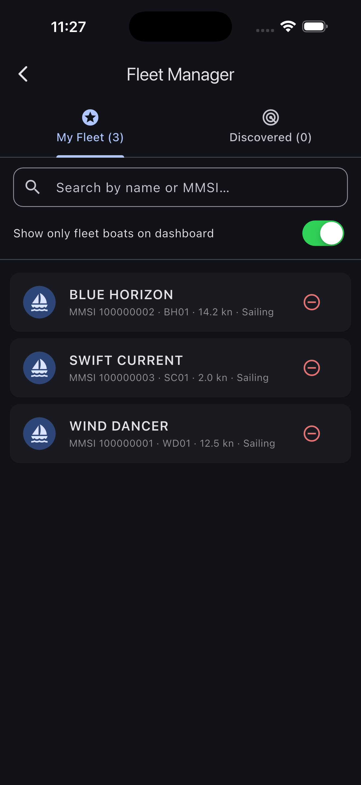
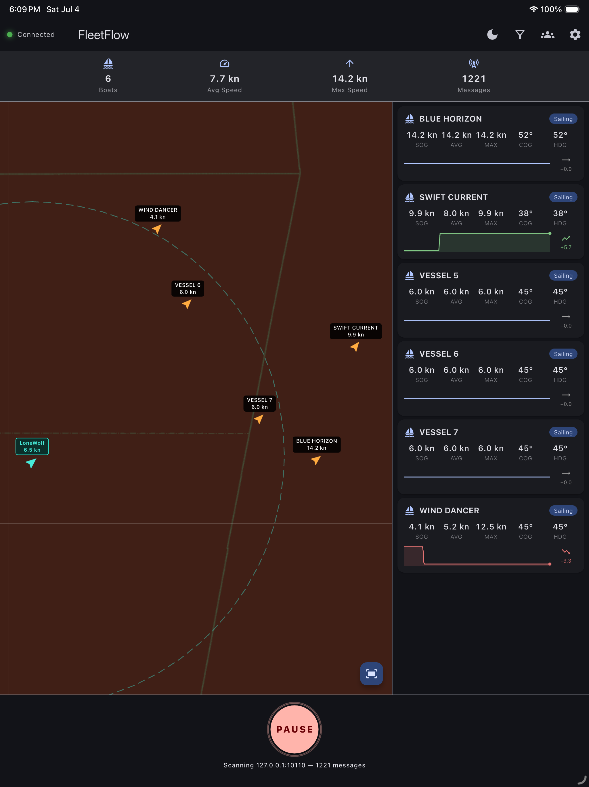
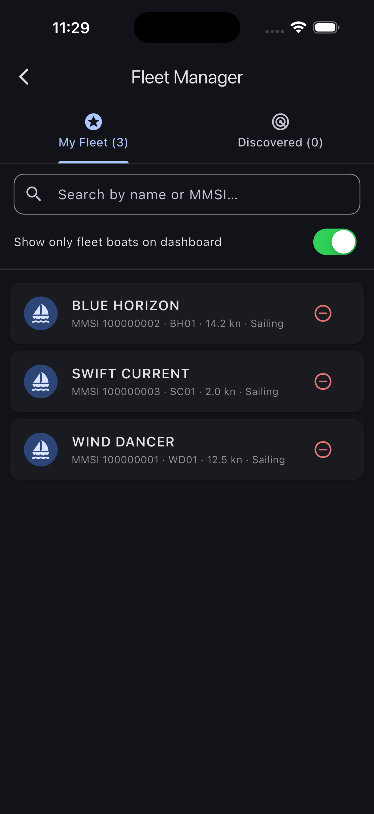

# FleetFlow

[](https://github.com/umutsoysal/FleetFlow/actions/workflows/flutter.yml)
[](https://github.com/umutsoysal/FleetFlow/releases)
[](https://pub.dev/packages/marine_ais)
[](https://flutter.dev)

An offshore race tracker for sailboats. FleetFlow connects to a **B&G Zeus3** or **Cortex** chartplotter over TCP and decodes live AIS/NMEA data to display your entire fleet on an interactive map with real-time speed and position telemetry.

## Screenshots

<p align="center">
  
  
</p>

<p align="center">
  
</p>

FleetFlow gives skippers and race crews a live fleet dashboard, an at-a-glance speed summary, and a dedicated fleet manager for curating the boats that matter during a race.

---

## Features

- **Live AIS decoding** — parses NMEA 0183 `!AIVDM`/`!AIVDO` sentences for both Class A (types 1, 2, 3, 5) and Class B (types 18, 19, 24) transponders to extract position, SOG, COG, heading, navigation status, vessel name, and call sign; "not available" sentinel values are filtered out rather than shown as bogus readings
- **Auto-reconnect** — dropped TCP connections retry automatically with exponential backoff (2s–30s, up to 10 attempts), so a flaky boat Wi-Fi doesn't silently stop the feed mid-race
- **Interactive dark chart** — OpenStreetMap tiles rendered with a nautical dark filter; map auto-fits to the fleet on first fix
- **Fleet summary bar** — at-a-glance fleet count, average speed, and max speed across all active boats
- **Boat roster** — scrollable card list showing each vessel's name/MMSI, speed, course, heading, call sign, and navigation status; stale contacts (>5 min) are visually dimmed
- **Speed history** — each boat retains the last 60 speed samples for average and peak calculations
- **Responsive layout** — side-by-side map + roster on wide screens; stacked on narrow/mobile
- **Simulator-ready connection flow** — connect to onboard hardware or a local simulator harness over TCP

---

## Architecture

```
lib/
├── main.dart                        # App entry point, Provider setup
├── models/
│   ├── boat.dart                    # Boat entity, SpeedSample, NavigationStatus, ShipType
│   └── fleet_manager.dart           # ChangeNotifier — connection state, boat registry, fleet stats
├── networking/
│   ├── nmea_connection.dart         # Raw TCP socket → line-buffered ASCII stream
│   ├── nmea_parser.dart             # Tokenises NMEA sentences and validates checksums
│   └── ais_decoder.dart             # Bit-level AIS payload decoder (Class A 1/2/3/5, Class B 18/19/24)
├── screens/
│   ├── dashboard_screen.dart        # Main scaffold with AppBar, summary bar, map, and table
│   ├── app_settings_screen.dart     # Full settings experience: connection, vessel, appearance, legal
│   └── legal_document_screen.dart   # About, Privacy Policy, Terms of Use content pages
└── widgets/
    ├── fleet_map.dart               # flutter_map with dark tile filter and boat markers
    ├── fleet_table.dart             # Scrollable boat card list
    ├── fleet_summary_bar.dart       # Active count / avg speed / max speed row
    └── connection_indicator.dart    # AppBar connection status chip
```

State is managed with a single `FleetManager` (`ChangeNotifier`) provided at the root via `provider`.

---

## Getting Started

### Prerequisites

| Tool | Version |
|------|---------|
| Flutter | ≥ 3.x (Dart SDK `^3.11.0`) |
| Xcode | ≥ 15 (iOS target) |
| Android Studio / SDK | API 21+ (Android target) |

### Install dependencies

```bash
flutter pub get
```

### Run

```bash
flutter run
```

Pick a connected device or simulator. For the best experience on a race boat, run on an iPad or large-screen Android tablet connected to the same Wi-Fi network as your B&G system.

### Connect to B&G

1. On your Zeus3 or Cortex, enable the **NMEA TCP server** (default port `10110`).
2. Open **FleetFlow → Settings** (gear icon in the top-right).
3. Enter the chartplotter's IP address and port, then tap **Connect**.

The default host is `192.168.1.1:10110`, which is the factory default for most B&G units on their own Wi-Fi hotspot.

---

## Dependencies

| Package | Purpose |
|---------|---------|
| [`provider`](https://pub.dev/packages/provider) | State management |
| [`flutter_map`](https://pub.dev/packages/flutter_map) | Interactive map with OpenStreetMap tiles |
| [`latlong2`](https://pub.dev/packages/latlong2) | Latitude/longitude types and distance math |
| [`intl`](https://pub.dev/packages/intl) | Number and date formatting |

---

## Development

### Simulator harness

Use your preferred simulator harness to feed AIS and NMEA traffic into FleetFlow over TCP during development and pre-race checks.

### Running tests

```bash
flutter test
```

### Linting

```bash
flutter analyze
```

---

## Platform Support

| Platform | Status |
|----------|--------|
| iOS | Supported |
| Android | Supported |
| macOS | Supported |
| Linux / Windows / Web | Untested |
